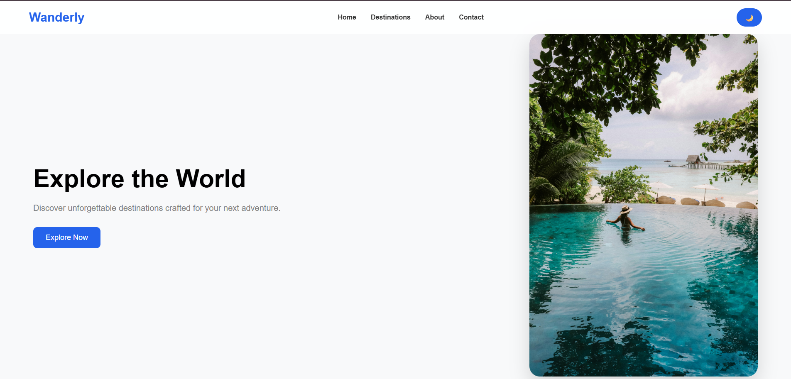

# Wanderly 🌴

A modern travel landing page designed to inspire users to explore destinations and plan their next adventure.

## 🌐 Live Demo

https://mfatima-dev.github.io/Wanderly/

## ✨ Features

- Responsive travel landing page
- Clean and modern user interface
- Destination-focused design
- Interactive navigation
- Dark mode toggle
- Responsive hero section
- Smooth and user-friendly experience

## 🛠️ Technologies

- HTML5
- CSS3
- JavaScript

## 📸 Preview



## 📂 Project Structure

```text
Wanderly/
├── images/
│   ├── hero.jpg
│   └── wanderly-preview.png
├── index.html
├── style.css
├── script.js
└── README.md